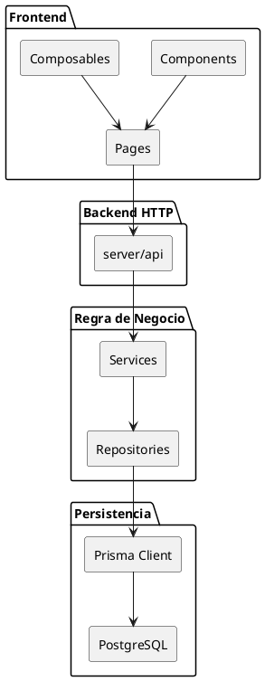
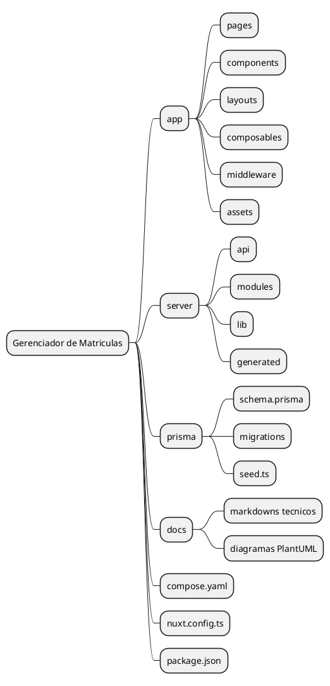
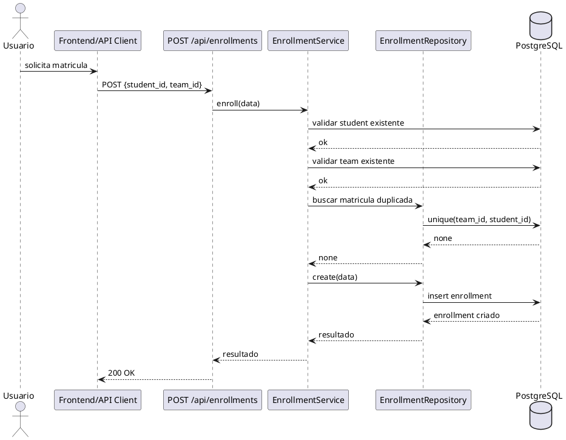
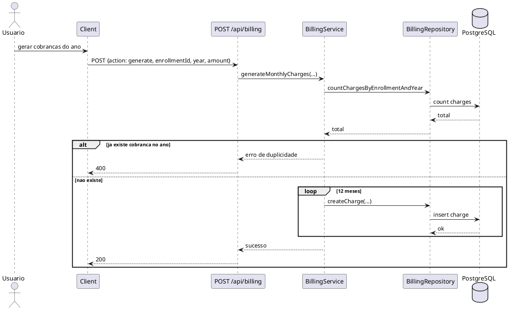

# Arquitetura

## Objetivo da Pagina

Documentar as camadas da aplicacao, a organizacao de diretorios e os principais fluxos.

## Escopo

- Inclui frontend, backend HTTP, dominio e persistencia.
- Nao inclui guia operacional de deploy.

## Visao Geral

O projeto segue uma arquitetura em camadas, com separacao simples entre interface, rotas HTTP, regras de negocio e persistencia.

Fonte do diagrama: [docs/plantuml/arquitetura-geral.puml](docs/plantuml/arquitetura-geral.puml).

## Camadas

### Frontend

Fica em app/ e e composto principalmente por paginas, componentes e composables. O Nuxt resolve as rotas de pagina automaticamente a partir de app/pages.

### Backend HTTP

Fica em server/api. Cada arquivo representa um endpoint HTTP. Essa camada e fina: le o request, valida formato minimo, chama o service e traduz excecoes em respostas HTTP.

### Regra de negocio

Fica em server/modules. Cada modulo tem tres arquivos:

- model.ts: definicoes de tipos do dominio local;
- repository.ts: operacoes de acesso a dados;
- service.ts: validacoes e orquestracao.

### Persistencia

O schema do banco fica em prisma/schema.prisma. O client gerado sai em server/generated e e consumido por server/lib/prisma.ts e pelos repositories.

## Organizacao dos Diretorios

Fonte do diagrama: [docs/plantuml/organizacao-diretorios.puml](docs/plantuml/organizacao-diretorios.puml).

## Responsabilidade por Diretorio

| Diretorio | Responsabilidade |
| --- | --- |
| app/pages | paginas roteaveis do frontend |
| app/components | componentes reutilizaveis |
| app/layouts | layouts compartilhados |
| app/composables | logica reaproveitavel da UI |
| app/middleware | middleware de navegacao do Nuxt |
| app/assets | estilos e recursos estaticos do app |
| server/api | endpoints HTTP |
| server/modules | regras de negocio por modulo |
| server/lib | utilitarios server-side |
| server/generated | artefatos gerados pelo Prisma |
| prisma | schema, migrations e seed |
| docs | documentacao e diagramas |

## Fluxo de Funcionamento

### Fluxo de navegacao atual

1. O usuario acessa o frontend.
2. O middleware global do app verifica a sessao via `useAuth().ensureSession()`.
3. Se necessario, o frontend consulta `GET /api/auth/me`.
4. Rotas protegidas so seguem com sessao valida.
5. O backend tambem valida o cookie nas rotas `/api/*` protegidas.

### Fluxo de requisicao backend

1. O cliente chama uma rota em server/api.
2. A rota interpreta parametros e body.
3. O service do modulo valida as regras de negocio.
4. O repository executa a operacao via Prisma.
5. O resultado volta como JSON.

### Fluxo de matricula

Fonte do diagrama: [docs/plantuml/fluxo-matricula.puml](docs/plantuml/fluxo-matricula.puml).

### Fluxo de cobranca

Fonte do diagrama: [docs/plantuml/fluxo-cobranca.puml](docs/plantuml/fluxo-cobranca.puml).

## Observacoes de Arquitetura

- O backend esta mais maduro que o frontend.
- A autenticacao agora existe no backend e no frontend, mas ainda em formato simples de usuario administrativo unico.
- A pasta server/generated nao deve ser editada manualmente.
- O arquivo [docs/plantuml/db_relations.wsd](docs/plantuml/db_relations.wsd) representa o modelo relacional de referencia.

## Referencias

- [docs/README.md](docs/README.md)
- [docs/projeto.md](docs/projeto.md)
- [docs/rotas.md](docs/rotas.md)
- [docs/autenticacao.md](docs/autenticacao.md)
