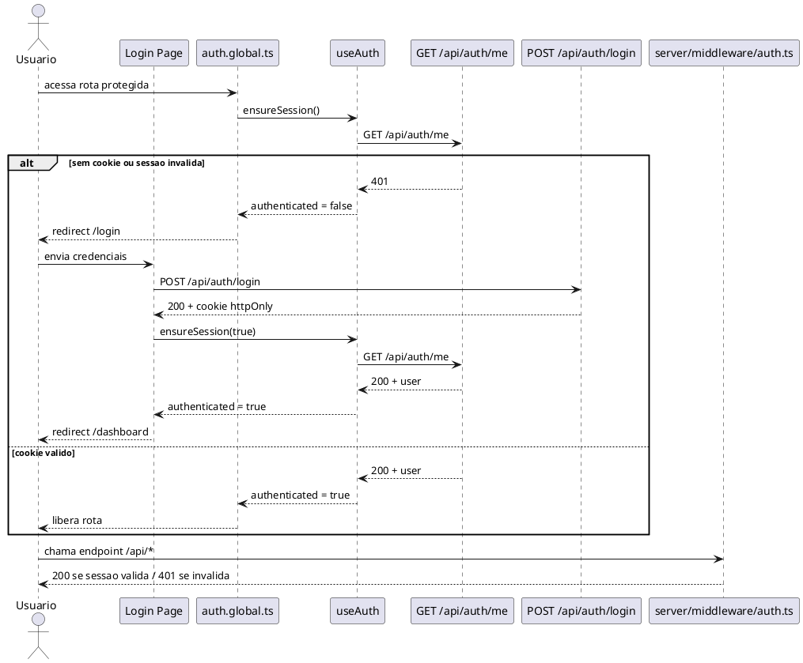

# Fluxo de Autenticacao

## Objetivo da Pagina

Descrever o fluxo completo de autenticacao entre frontend, middleware, backend e cookie de sessao.

## Escopo

- Inclui login, validacao de sessao, protecao de pagina e logout.
- Nao inclui diagramas de autorizacao por perfil.

## Fluxo Resumido

1. O usuario acessa uma pagina protegida.
2. O middleware global do app consulta o estado de sessao usando `useAuth().ensureSession()`.
3. Se a sessao nao estiver carregada, o frontend chama `GET /api/auth/me`.
4. Se o backend validar o cookie, a navegacao continua.
5. Se nao houver cookie valido, o usuario e redirecionado para `/login`.
6. No login, o frontend chama `POST /api/auth/login`.
7. O backend responde com cookie httpOnly e a sessao passa a ser valida.
8. No logout, o frontend chama `POST /api/auth/logout` e o cookie e limpo.

## Diagrama

Fonte do diagrama: [docs/plantuml/fluxo-autenticacao.puml](docs/plantuml/fluxo-autenticacao.puml).

## Pontos de Controle

### No frontend

- [app/middleware/auth.global.ts](app/middleware/auth.global.ts): protege paginas por padrao.
- [app/composables/useAuth.ts](app/composables/useAuth.ts): evita repeticao de chamadas e centraliza o estado.

### No backend

- [server/middleware/auth.ts](server/middleware/auth.ts): protege endpoints de negocio.
- [server/api/auth/me.get.ts](server/api/auth/me.get.ts): entrega a verdade da sessao para o app.

## Comportamento com AUTH_ENABLED=false

Quando `AUTH_ENABLED = false` em [nuxt.config.ts](nuxt.config.ts):

- o middleware do app retorna imediatamente sem chamar `ensureSession`;
- o frontend nao faz nenhuma requisicao a `GET /api/auth/me`;
- o middleware do server nao bloqueia `/api/*`.

Esse modo e definido em tempo de build. Para alterar, mude a constante e rebuilde a aplicacao.

Esse modo existe para facilitar demos, desenvolvimento local e diagnostico.

## Referencias

- [docs/README.md](docs/README.md)
- [docs/autenticacao.md](docs/autenticacao.md)
- [docs/rotas.md](docs/rotas.md)
