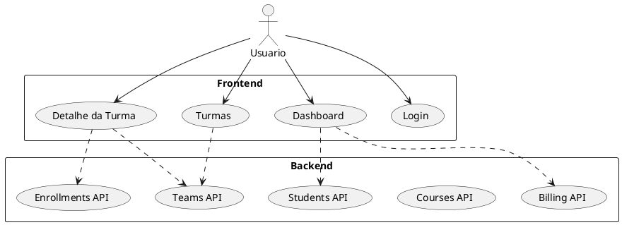

# Rotas

## Objetivo da Pagina

Catalogar rotas de paginas e endpoints HTTP disponiveis no estado atual do projeto.

## Escopo

- Inclui rotas frontend e backend com payloads principais.
- Nao inclui contratos OpenAPI formais.

## Rotas de Pagina

As rotas de pagina sao resolvidas automaticamente pelo Nuxt a partir de app/pages.

| Rota | Arquivo | Descricao |
| --- | --- | --- |
| `/` | [/app/pages/index.vue](/app/pages/index.vue) | tela inicial atualmente com layout de turmas em modo prototipo |
| `/login` | [/app/pages/login.vue](/app/pages/login.vue) | login via backend com criacao de sessao |
| `/dashboard` | [/app/pages/dashboard.vue](/app/pages/dashboard.vue) | dashboard visual com indicadores mockados |
| `/turmas` | [/app/pages/turmas/index.vue](/app/pages/turmas/index.vue) | lista de turmas em modo prototipo |
| `/turmas/:id` | [/app/pages/turmas/[id].vue](/app/pages/turmas/%5Bid%5D.vue) | detalhe de turma e alunos em modo prototipo |

## Observacoes Sobre o Frontend

- [/app/pages/login.vue](/app/pages/login.vue) usa o endpoint `POST /api/auth/login`.
- [/app/pages/dashboard.vue](/app/pages/dashboard.vue) usa cards e lista de alunos mockados.
- [/app/pages/index.vue](/app/pages/index.vue) e [/app/pages/turmas/index.vue](/app/pages/turmas/index.vue) hoje possuem fluxos prototipados de turmas.
- [/app/pages/turmas/[id].vue](/app/pages/turmas/%5Bid%5D.vue) usa dados mockados para os alunos.
- O frontend usa middleware global de autenticacao e o backend protege endpoints via cookie de sessao.

## Rotas de API

### Swagger

- UI interativa: `/api/docs`
- JSON OpenAPI: `/api/docs/openapi`
- YAML OpenAPI: `/api/docs/openapi.yaml`

Para sincronizar a colecao Bruno/OpenCollection com a especificacao Swagger:

```bash
bun run sync:opencollection
```

### Autenticacao

| Metodo | Rota | Arquivo | Comportamento |
| --- | --- | --- | --- |
| POST | `/api/auth/login` | [/server/api/auth/login.post.ts](/server/api/auth/login.post.ts) | cria sessao via cookie httpOnly |
| POST | `/api/auth/logout` | [/server/api/auth/logout.post.ts](/server/api/auth/logout.post.ts) | remove sessao atual |
| GET | `/api/auth/me` | [/server/api/auth/me.get.ts](/server/api/auth/me.get.ts) | retorna usuario da sessao |

Quando a autenticacao esta habilitada, os endpoints de negocio em `/api/*` exigem sessao valida e retornam 401 sem cookie de autenticacao.

Toggle da autenticacao (constante de build em [nuxt.config.ts](nuxt.config.ts)):

- `AUTH_ENABLED = true`: autenticacao habilitada.
- `AUTH_ENABLED = false`: autenticacao desabilitada no backend e no app.

Alteracoes nesse valor requerem rebuild da aplicacao.

### Cursos

| Metodo | Rota | Arquivo | Comportamento |
| --- | --- | --- | --- |
| GET | `/api/courses` | [/server/api/courses/index.get.ts](/server/api/courses/index.get.ts) | lista cursos com turmas |
| POST | `/api/courses` | [/server/api/courses/index.post.ts](/server/api/courses/index.post.ts) | cria curso |
| GET | `/api/courses/:id` | [/server/api/courses/[id].get.ts](/server/api/courses/%5Bid%5D.get.ts) | busca curso por id |
| PUT | `/api/courses/:id` | [/server/api/courses/[id].put.ts](/server/api/courses/%5Bid%5D.put.ts) | atualiza curso |
| DELETE | `/api/courses/:id` | [/server/api/courses/[id].delete.ts](/server/api/courses/%5Bid%5D.delete.ts) | remove curso |

#### Payload principal de curso

```json
{
  "title": "Curso de Matematica",
  "active": true
}
```

### Estudantes

| Metodo | Rota | Arquivo | Comportamento |
| --- | --- | --- | --- |
| GET | `/api/students` | [/server/api/students/index.get.ts](/server/api/students/index.get.ts) | lista estudantes |
| POST | `/api/students` | [/server/api/students/index.post.ts](/server/api/students/index.post.ts) | cria estudante |
| GET | `/api/students/:id` | [/server/api/students/[id].get.ts](/server/api/students/%5Bid%5D.get.ts) | busca por id |
| PUT | `/api/students/:id` | [/server/api/students/[id].put.ts](/server/api/students/%5Bid%5D.put.ts) | atualiza estudante |
| DELETE | `/api/students/:id` | [/server/api/students/[id].delete.ts](/server/api/students/%5Bid%5D.delete.ts) | remove estudante |

#### Payload principal de estudante

```json
{
  "name": "Kaleb Gato",
  "cpf": "123.456.789-00",
  "email": "kaleb@example.com",
  "dn": "2006-01-01T00:00:00.000Z",
  "phone": "99999-0000",
  "responsable_name": "Responsavel Kaleb",
  "responsable_phone": "99999-9999",
  "active": true
}
```

### Turmas

| Metodo | Rota | Arquivo | Comportamento |
| --- | --- | --- | --- |
| GET | `/api/teams` | [/server/api/teams/index.get.ts](/server/api/teams/index.get.ts) | lista todas as turmas |
| GET | `/api/teams?course_id=...` | [/server/api/teams/index.get.ts](/server/api/teams/index.get.ts) | filtra turmas por curso |
| POST | `/api/teams` | [/server/api/teams/index.post.ts](/server/api/teams/index.post.ts) | cria turma |
| GET | `/api/teams/:id` | [/server/api/teams/[id].get.ts](/server/api/teams/%5Bid%5D.get.ts) | busca turma por id |
| PUT | `/api/teams/:id` | [/server/api/teams/[id].put.ts](/server/api/teams/%5Bid%5D.put.ts) | atualiza turma |
| DELETE | `/api/teams/:id` | [/server/api/teams/[id].delete.ts](/server/api/teams/%5Bid%5D.delete.ts) | remove turma |

#### Payload principal de turma

```json
{
  "course_id": "uuid-do-curso",
  "title": "Turma A - Matematica",
  "team_leader_id": "uuid-ou-identificador",
  "start_date": "2026-02-01T00:00:00.000Z",
  "end_date": "2026-12-20T00:00:00.000Z",
  "horary": "18:00-20:00",
  "days_of_week": "Segunda,Quarta",
  "active": true,
  "payment_date": "2026-02-10T00:00:00.000Z",
  "price": 500
}
```

### Matriculas

| Metodo | Rota | Arquivo | Comportamento |
| --- | --- | --- | --- |
| GET | `/api/enrollments` | [/server/api/enrollments/index.get.ts](/server/api/enrollments/index.get.ts) | lista matriculas com student e team |
| POST | `/api/enrollments` | [/server/api/enrollments/index.post.ts](/server/api/enrollments/index.post.ts) | cria matricula |
| GET | `/api/enrollments/:id` | [/server/api/enrollments/[id].get.ts](/server/api/enrollments/%5Bid%5D.get.ts) | busca matricula por id |
| GET | `/api/enrollments/student/:id` | [/server/api/enrollments/student/[id].get.ts](/server/api/enrollments/student/%5Bid%5D.get.ts) | lista matriculas de um estudante |

#### Payload principal de matricula

```json
{
  "student_id": "uuid-do-estudante",
  "team_id": "uuid-da-turma"
}
```

#### Validacoes relevantes

- estudante deve existir;
- turma deve existir;
- nao pode haver matricula duplicada para a combinacao team_id + student_id.

### Cobranca e Pagamentos

| Metodo | Rota | Arquivo | Comportamento |
| --- | --- | --- | --- |
| POST | `/api/billing` | [/server/api/billing/index.post.ts](/server/api/billing/index.post.ts) | gera cobrancas ou registra pagamento |
| GET | `/api/billing/late` | [/server/api/billing/late.get.ts](/server/api/billing/late.get.ts) | lista cobrancas atrasadas |

#### Acao generate

Payload:

```json
{
  "action": "generate",
  "enrollmentId": "uuid-da-matricula",
  "year": 2026,
  "amount": 500
}
```

Comportamento:

- gera 12 cobrancas mensais para a matricula;
- impede duplicidade anual;
- exige valor maior que zero.

#### Acao pay

Payload:

```json
{
  "action": "pay",
  "charge_id": "uuid-da-cobranca",
  "amount": 500,
  "method": "PIX"
}
```

Metodos aceitos:

- CREDIT_CARD
- DEBIT_CARD
- BOLETO
- PIX

Comportamento:

- exige charge existente;
- exige valor maior que zero;
- impede pagamento em cobranca ja quitada.

## Fluxo de Rotas



## Execucao Pratica

Para exemplos de requisicoes reais com curl, incluindo cenarios de erro e validacao de negocio, consulte [/docs/exemplos-api.md](/docs/exemplos-api.md).

## Referencias

- [/docs/README.md](/docs/README.md)
- [/docs/exemplos-api.md](/docs/exemplos-api.md)
- [/docs/troubleshooting.md](/docs/troubleshooting.md)
- [/docs/autenticacao.md](/docs/autenticacao.md)
- [/docs/composables.md](/docs/composables.md)
